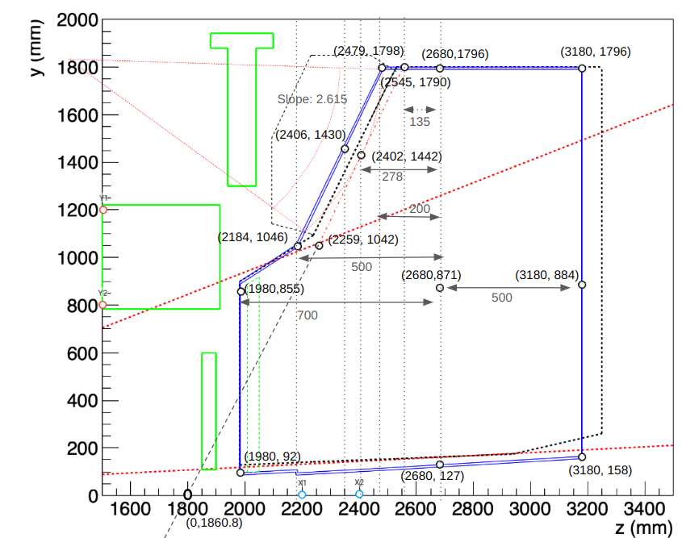

# Calculations for placement of quartz window:

The quartz window is a section of cylinder which rotated and translated to such that it is tangential to the central sensor in each sector. In order to have it tangetial, we need a *forward* tilt to each window.

We place the cylinder origin at the centre of the vessel (0,0,2680), rotate it about z, forward tilt and the shift it to align with the front of the sensor box

- Rotation about 'z': Same as done for the sensor boxes


- Slope of the quartz window: 
    - From the diagram,  consider two points on the line of the quartz window:
    (2545,1790) and (2259,1042)
    - ```slope:``` 
        - $m= \frac{1790-1042}{2545-2259}$= 2.615
    ```c
    float qw_slope    =  (quartzwinRmax - quartzwinRmin)/(quartzwinZmax-quartzwinZmin);
    ```
- ```Intercept```: This line (l) meets the   x-axis at: 
    - y = mz + c
    - m = 2.615
    - c = y-mz = 1790-2.615*2545 = -4866
    - Intercept at y=0: z=-c/m = 4866/2.615 =  1860.80
    - This point is indicated on the x-axis as (0,1860.8) 

    ```c
     float qw_intercpt =   quartzwinRmax - qw_slope*quartzwinZmax;
     ```

- Forward tilt of the quartz window:
This is the angle the dashed line that crosses the *x-axis* at (0,1860.4) makes with the *y-axis*. This line also has the same slope (2.615)
    - This is obtained by:
        - ```theta```
            - $90 \degree - tan^{-1}(m)=(90-69.07) \degree = 20.92 \degree $ 
    ```c
    double qw_angle    =   (atan(qw_slope)-(M_PI/2));
    ```
- Shifting of origin: Since the window rotations and tilts are performed at the origin, it needs to be shifted so that it sits at the front of the sensor box.
    - This shift is the distance of the dashed line intercepting the *x-axis* at (0,1860.4) from the origin (0,2680)
    - ```Shift:```
        - 1860-2680 = -820
  
  ```c
  double qw_zpos     = -((qw_intercpt/qw_slope) + vesselPos.z()) + quartzwinThickness/2 + quartzwinShift;
    ```
Note that the centre has to be offset by ```quartzwinThickness/2``` to account for the thickness. ```quartzwinShift``` is a adjustable parameter to shift the window from the sensors.

- Now due to the forward tilt the upper edge of the cylinder is not aligned at the right position. Infact, it is pushed down due to the forward tilt. This is corrected by increasing the outer and inner radius accordingly.

The rotation matrix gives the position of a point y after rotation:

$ y' = y  cos(\theta) - z sin (\theta) $

z=0 and y', the point on the top edge of the window is the outer radius of the window after the rotation (which is given as 1790). We need y, the outer radius before rotation:

$y = \frac{y'}{cos(\theta)} = \frac{1790}{cos(20.92 \degree)} = 191.638$

This is the outer radius of the cylinder before rotation, which when rotated becomes 1790 as specified.

The inner radius is also increased accordingly.

```c
  float quartzwinRmax2 = (quartzwinRmax) / cos(qw_angle);
  float quartzwinRmin2 = (quartzwinRmax2-quartzwinRmax)+(quartzwinRmin);
  ```